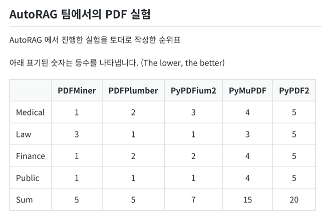

# AI Demos

## Langchain

### Install

```shell
pip install langchain langchain-community langchain-ollama beautifulsoup4
pip install transformers pdfminer.six pypdf black
```

### 헷지

pydantic 사용시에는 `from langchain_ollama import ChatOllama`을 사용



### Ref

* [Langchain Docs](https://python.langchain.com/v0.2/docs/introduction/)
* [Langchain Tutorial-1](https://wikidocs.net/231393)
* [Langchain Tutorial-2](https://wikidocs.net/233348)

## Personal Ref

* [ipython Langchain](https://github.com/kwon0koang/test_langchain/blob/master/src/0200_memory.ipynb)