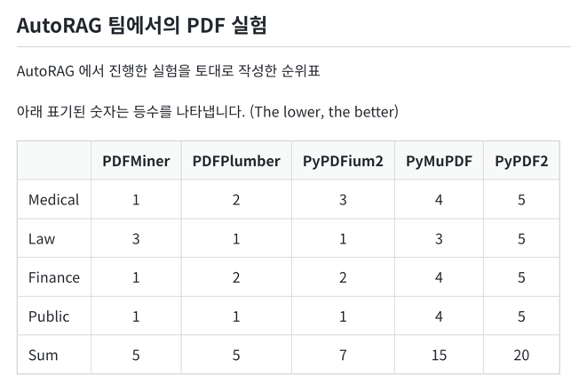
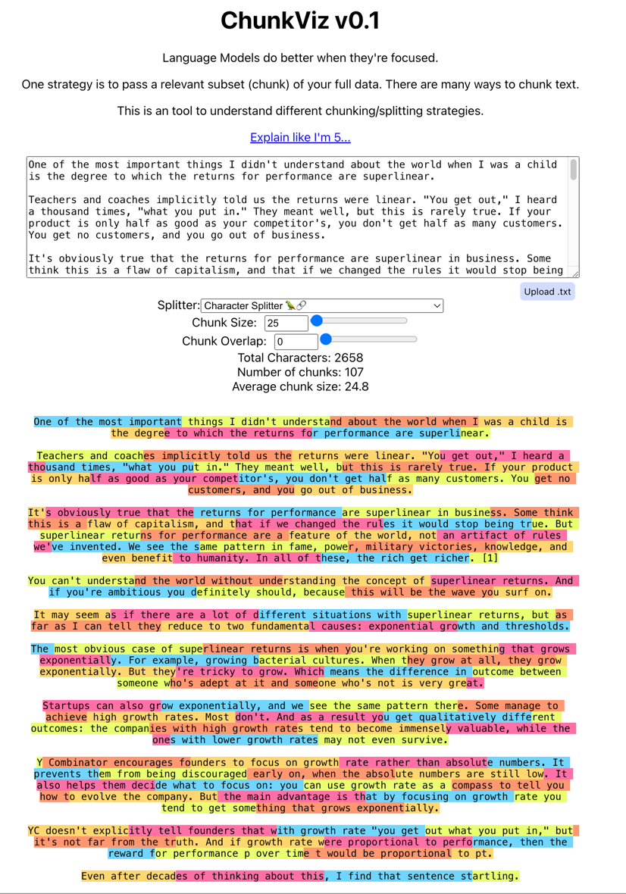

# Langchain

## Common Install

```shell
pip install langchain langchain-community langchain-ollama beautifulsoup4
pip install python-dotenv transformers pdfminer.six pypdf black unstructured

# agent web search
pip install tavily-python
```

## LangServe

```shell
pip install "langserve[server]" langchain-cli

langchain app new demoapp     
```

```python
from langchain_demos.llama31.example.memory.conversation_buffer_simple import chain as conversation_chain

...

add_routes(app, conversation_chain, path="/demo")
```

http://localhost:8000/demo/playground/ 접속

## 라마 헷지

pydantic 사용시에는 `from langchain_ollama import ChatOllama`을 사용

## PDF 라이브러리 적합도



## Chunk Viz

https://chunkviz.up.railway.app/



## API

* [tavily](https://app.tavily.com/home)

## Ref

* [Langchain Docs](https://python.langchain.com/v0.2/docs/introduction/)
* [Langchain Tutorial-1](https://wikidocs.net/231393)
* [Langchain Tutorial-2](https://wikidocs.net/233348)

## Personal Ref

* [ipython Langchain](https://github.com/kwon0koang/test_langchain/blob/master/src/0200_memory.ipynb)